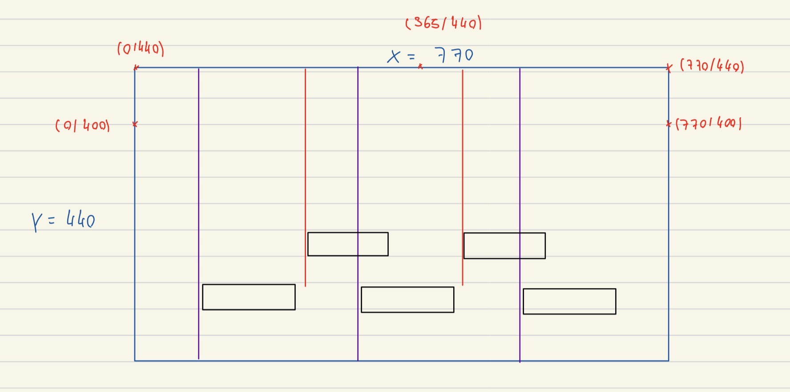
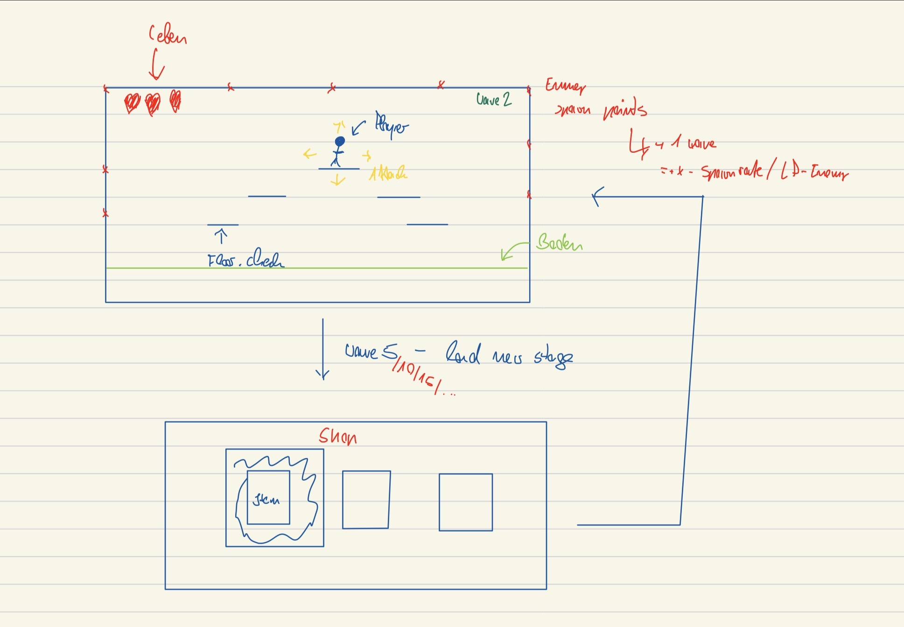

# Platformer THE GAME 

## Game idea 
Platformer THE GAME is a small 2D arena platformer. The player moves across a compact platform map, jumps between ledges, and fights enemies with a short melee attack while trying to stay alive with a limited number of lives.

The current idea is to grow the game into round-based survival: enemies spawn from different sides of the map, chase the player, and deal damage on contact. After surviving rounds, the player should be able to enter a shop and buy upgrades such as more damage, more range, extra HP, more speed, or a dash. 

## Development 
### Code Strucutre

We deployed the MCV pattern for easy class overview aswell as it being industry standart for games. Easy debugging and a nice layer overwiev what makes it easy to adjust. The code for this project can be found in "core/src/main/java/io/github/platform" 

### Schedule 


### Work Distribution

**Impotant Note!!!: Most of the code changes were contributed throught lorenzoothaaboy as we were pair-programming over discord or in class and it was just more convinient to do most of the work like _this._**

## Usage of Artifical Intelligence 
We used OpenAi's Codex to write code in this project and help with sprite generation and in the general game development process

## Overview of the game from a developmetal standpoint 

Map structure/math

Original draft for the game idead and cycle 


## Installation Guide
There are two normal ways to get the game:

1. Install it from the source code with Git and Gradle.
2. Download a precompiled build from the project's release page, if one has been uploaded.

The game is a Java/libGDX desktop project. The main desktop launcher is in the `lwjgl3` module.

### Requirements

- Java 11 or newer. Java 21 is recommended if you want to build packaged executables.
- Git, if you want to install or update from the source code.
- No separate Gradle installation is needed, because the project includes the Gradle wrapper.

Check Java with:

```bash
java -version
```

### Install from Git

Clone the repository:

```bash
git clone https://github.com/LorenzooThaaBoy/Platform.exe
cd Platform.exe
```

If you already cloned it before, update it with:

```bash
git pull
```

Run the game from source:

```bash
./gradlew lwjgl3:run
```

On Windows, use:

```bat
gradlew.bat lwjgl3:run
```

### Build a Runnable JAR

To build a normal runnable desktop JAR:

```bash
./gradlew lwjgl3:jar
```

The output will be created in:

```text
lwjgl3/build/libs/
```

For this project version, the file name should look like:

```text
Platformer2.0-1.0.0.jar
```

Run it with:

```bash
java -jar lwjgl3/build/libs/Platformer2.0-1.0.0.jar
```

You can also build smaller platform-specific JARs:

```bash
./gradlew lwjgl3:jarMac
./gradlew lwjgl3:jarWin
./gradlew lwjgl3:jarLinux
```

These are still Java JAR files, so the player still needs Java installed.

### Build a Packaged Executable

The project also includes libGDX/Construo packaging tasks. These create platform-specific builds that bundle a Java runtime, so players usually do not need to install Java separately.

macOS Apple Silicon:

```bash
./gradlew lwjgl3:packageMacM1
```

macOS Intel:

```bash
./gradlew lwjgl3:packageMacX64
```

Windows 64-bit:

```bash
./gradlew lwjgl3:packageWinX64
```

Linux 64-bit:

```bash
./gradlew lwjgl3:packageLinuxX64
```

The packaged builds are created somewhere inside:

```text
lwjgl3/build/construo/
```

The first time you run one of these packaging tasks, Gradle may download dependencies and a JDK. That is normal.

### Download a Precompiled Build

If the project has a GitHub Releases page, this is the easiest option for players:

1. Open the repository on GitHub.
2. Go to `Releases`.
3. Download the file for your operating system.
4. Extract the downloaded `.zip` if needed.
5. Start the included executable or run the `.jar`.

If you download a `.jar`, run it with:

```bash
java -jar Platformer2.0-1.0.0.jar
```

If you download a packaged executable, Java should already be bundled.

### macOS Notes

If macOS blocks the game because it is from an unidentified developer, right-click the app and choose `Open`. You may need to confirm this once in System Settings.

If you are running the JAR manually on macOS and it fails to open correctly, use the Gradle run task instead:

```bash
./gradlew lwjgl3:run
```

### Windows

Use `gradlew.bat` instead of `./gradlew`.

Run from source:

```bat
gradlew.bat lwjgl3:run
```

Build the runnable JAR:

```bat
gradlew.bat lwjgl3:jar
```

Build the packaged Windows version:

```bat
gradlew.bat lwjgl3:packageWinX64
```

If Windows Defender complains about a downloaded build, it is usually because the executable is unsigned. Use the JAR build or build it locally from source if needed.


## LibGDX Information 
A [libGDX](https://libgdx.com/) project generated with [gdx-liftoff](https://github.com/libgdx/gdx-liftoff).

This project was generated with a template including simple application launchers and an `ApplicationAdapter` extension that draws libGDX logo.

### Platforms

- `core`: Main module with the application logic shared by all platforms.
- `lwjgl3`: Primary desktop platform using LWJGL3; was called 'desktop' in older docs.

### Gradle

This project uses [Gradle](https://gradle.org/) to manage dependencies.
The Gradle wrapper was included, so you can run Gradle tasks using `gradlew.bat` or `./gradlew` commands.
Useful Gradle tasks and flags:

- `--continue`: when using this flag, errors will not stop the tasks from running.
- `--daemon`: thanks to this flag, Gradle daemon will be used to run chosen tasks.
- `--offline`: when using this flag, cached dependency archives will be used.
- `--refresh-dependencies`: this flag forces validation of all dependencies. Useful for snapshot versions.
- `build`: builds sources and archives of every project.
- `cleanEclipse`: removes Eclipse project data.
- `cleanIdea`: removes IntelliJ project data.
- `clean`: removes `build` folders, which store compiled classes and built archives.
- `eclipse`: generates Eclipse project data.
- `idea`: generates IntelliJ project data.
- `lwjgl3:jar`: builds application's runnable jar, which can be found at `lwjgl3/build/libs`.
- `lwjgl3:run`: starts the application.
- `test`: runs unit tests (if any).

Note that most tasks that are not specific to a single project can be run with `name:` prefix, where the `name` should be replaced with the ID of a specific project.
For example, `core:clean` removes `build` folder only from the `core` project.
